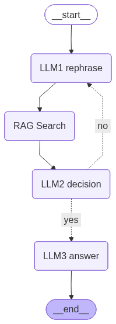

# RAGBot with LangGraph

[](https://opensource.org/licenses/MIT)
[](https://langchain-ai.github.io/langgraph/)

This project implements a robust Retrieval-Augmented Generation (RAG) system using **LangGraph** and **LangChain**. It features a self-correcting pipeline that rephrases user queries, retrieves multimodal context (text, images, tables) from PDFs, and grades the relevance of retrieved documents before generating a final answer.

## 🚀 Features

- **Multimodal PDF Ingestion**: Uses `unstructured` to partition PDFs into text, tables, and images.
- **Image Analysis**: Uses **Llama-4-Scout** (via Groq) to describe images found in PDFs for better retrieval.
- **Semantic Chunking**: Uses `SemanticChunker` with HuggingFace embeddings for intelligent text splitting.
- **Self-Correcting RAG Pipeline**:
    - **Query Rephrasing**: Optimizes user queries for vector search.
    - **Relevance Grading**: Evaluates retrieved documents and loops back if they are irrelevant.
    - **Hallucination Check**: Ensures answers are grounded in the retrieved context.
- **Vector Store**: Uses **ChromaDB** for efficient similarity search.

## 🛠️ Installation

1.  **Clone the repository**:
    ```bash
    git clone https://github.com/LouiZz04/RAGBOT.git
    cd RAGBOT
    ```

2.  **Install dependencies**:
    Ensure you have Python 3.13+ installed. You can install the required packages using pip:

    ```bash
    pip install langchain langgraph langchain-groq langchain-huggingface langchain-chroma langchain-experimental unstructured[pdf] python-dotenv ipython
    ```

    *Note: You may need to install system dependencies for `unstructured` (e.g., `poppler-utils`, `tesseract-ocr`).*

3.  **Set up Environment Variables**:
    Create a `.env` file in the root directory and add your Groq API key:

    ```env
    GROQ_API_KEY=your_groq_api_key_here
    ```

## 🧠 Architecture Graph

The system uses **LangGraph** to orchestrate the RAG flow. Below is the visualization of the control flow:



### Flow Description:
1.  **LLM1 Rephrase**: The user's input is rephrased into a keyword-heavy technical search query.
2.  **RAG Search**: Retrieves the top 5 most similar documents (text chunks, image descriptions, tables) from ChromaDB.
3.  **LLM2 Decision**: An LLM grades the retrieved documents. If they are relevant to the question, it proceeds. If not, it loops back to rephrase the query (up to 3 times).
4.  **LLM3 Answer**: Generates a detailed, evidence-based engineering answer using *only* the retrieved context.

### Flow Description:
1.  **LLM1 Rephrase**: The user's input is rephrased into a keyword-heavy technical search query.
2.  **RAG Search**: Retrieves the top 5 most similar documents (text chunks, image descriptions, tables) from ChromaDB.
3.  **LLM2 Decision**: An LLM grades the retrieved documents. If they are relevant to the question, it proceeds. If not, it loops back to rephrase the query (up to 3 times).
4.  **LLM3 Answer**: Generates a detailed, evidence-based engineering answer using *only* the retrieved context.

## 💻 Usage

1.  **Run the Main Notebook**:
    Open `main.ipynb` in Jupyter Notebook or VS Code.

2.  **Initialize RAG**:
    Run the cells to initialize the graph. When prompted, enter the path to your PDF file.
    ```python
    # Example input
    Enter pdf path: ./docs/manual.pdf
    ```
    This will process the PDF, extract content, describe images, and build the vector database in `./chroma_db_data`.

3.  **Chat with your PDF**:
    The system will enter a loop where you can ask questions.
    ```text
    Hi there, ask me something...
    > What are the incertitude variables mentioned in section 5.1?
    ```

4.  **Exit**:
    Type `q` to exit the chat loop.

## 📂 File Structure

- `main.ipynb`: The core application logic containing the LangGraph definition and execution loop.
- `data_transformation.py`: Helper module for PDF partitioning, image description, and embedding generation.
- `RAG.py`: A script for testing the RAG extraction logic independently.
- `chroma_db_data/`: Directory where the vector database is persisted(will be created when RAG is implemented by your pdf).
- `temp_images/`: Temporary storage for extracted images from PDFs(same as chroma_db_data).

## 🤖 Models Used

- **LLM**: `llama-3.3-70b-versatile` (via Groq) for reasoning and answering.
- **Vision LLM**: `meta-llama/llama-4-scout-17b-16e-instruct` (via Groq) for image description.
- **Embeddings**: `paraphrase-multilingual-MiniLM-L12-v2` (via HuggingFace).
